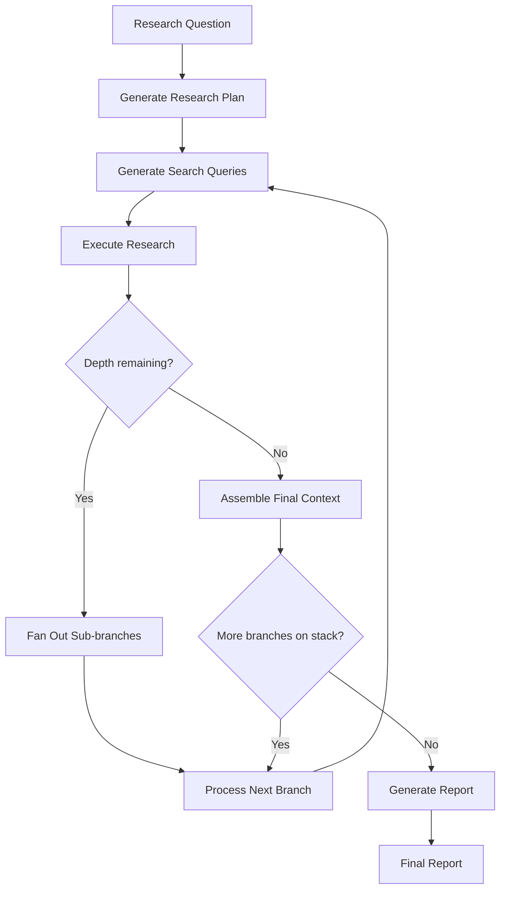
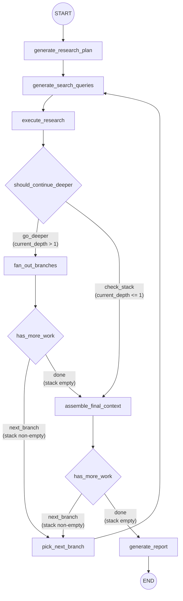

# deep_researcher_langgraph

A LangGraph-based re-implementation of the deep research workflow originally found in `gpt_researcher/skills/deep_research.py`. This package replaces the hand-rolled recursive logic with a declarative **LangGraph StateGraph**, making the pipeline easier to visualize, test, and extend.

Key LangChain v1 primitives used throughout:

- **StateGraph** (from `langgraph.graph`) -- orchestrates the entire multi-step research workflow as a directed graph with conditional edges.
- **ChatPromptTemplate** (from `langchain_core.prompts`) -- defines all prompt templates as reusable, parameterized message lists.
- **with_structured_output** (from `BaseChatModel`) -- forces LLM responses into Pydantic schemas for type-safe parsing.
- **BaseCallbackHandler** (from `langchain_core.callbacks`) -- tracks token usage and costs across every LLM invocation.

---

## Quick Start

### From Python (async)

```python
from deep_researcher_langgraph import run_deep_research

result = await run_deep_research(
    query="What are the latest advances in quantum error correction?",
    breadth=4,
    depth=2,
)
print(result["report"])
print(result["cost_summary"])
```

The returned dictionary contains the keys: `report`, `final_context`, `visited_urls`, `sources`, `learnings`, `citations`, and `cost_summary`.

### From the command line

```bash
python -m deep_researcher_langgraph.main "Your research question" --breadth 4 --depth 2
```

Additional CLI flags:

| Flag | Description |
|---|---|
| `--concurrency` | Max concurrent research tasks |
| `--tone` | Report tone, e.g. `Objective`, `Analytical` (default `Objective`) |
| `--config-path` | Path to a JSON config file that overrides defaults |

---

## Environment Variables

All configuration is loaded by `gpt_researcher.config.Config`. Environment variables take precedence over config-file values, which in turn take precedence over built-in defaults.

| Variable | Required | Default | Description |
|---|---|---|---|
| `OPENAI_API_KEY` | Yes (if using OpenAI) | -- | API key for OpenAI models. Required when using the default LLM and embedding providers. |
| `TAVILY_API_KEY` | Yes (if using Tavily) | -- | API key for the Tavily search retriever. Required when `RETRIEVER` includes `tavily` (the default). |
| `FAST_LLM` | No | `openai:gpt-4o-mini` | Fast, low-cost LLM. Format: `provider:model`. |
| `SMART_LLM` | No | `openai:gpt-4.1` | Higher-quality LLM used for report generation. Format: `provider:model`. |
| `STRATEGIC_LLM` | No | `openai:o4-mini` | Reasoning-capable LLM used for query generation and research analysis. Format: `provider:model`. |
| `EMBEDDING` | No | `openai:text-embedding-3-small` | Embedding model. Format: `provider:model`. |
| `RETRIEVER` | No | `tavily` | Comma-separated list of retrievers to use for web search. |
| `DEEP_RESEARCH_BREADTH` | No | `3` | Number of search queries generated per research level. |
| `DEEP_RESEARCH_DEPTH` | No | `2` | Number of recursive depth levels for the research tree. |
| `DEEP_RESEARCH_CONCURRENCY` | No | `4` | Maximum number of concurrent GPTResearcher tasks per level. |
| `REASONING_EFFORT` | No | `medium` | Reasoning effort for strategic LLM calls. Valid values: `low`, `medium`, `high`. |
| `DOC_PATH` | No | `./my-docs` | Path to local documents when using a local report source. |
| `MCP_STRATEGY` | No | `fast` | MCP execution strategy: `fast`, `deep`, or `disabled`. |
| `REPORT_SOURCE` | No | `web` | Source for research: `web`, `local`, `hybrid`, etc. |
| `SCRAPER` | No | `bs` | Web scraper backend (e.g. `bs` for BeautifulSoup). |
| `MAX_SEARCH_RESULTS_PER_QUERY` | No | `5` | Maximum search results returned per query. |
| `TEMPERATURE` | No | `0.4` | Default LLM temperature. |
| `TOTAL_WORDS` | No | `1200` | Target word count for generated reports. |
| `REPORT_FORMAT` | No | `APA` | Citation format for reports. |
| `LANGUAGE` | No | `english` | Language for the generated report. |
| `VERBOSE` | No | `False` | Enable verbose logging. |
| `LLM_KWARGS` | No | `{}` | JSON string of additional keyword arguments passed to the LLM provider. |
| `LANGCHAIN_API_KEY` | No | -- | Enables LangSmith tracing when set. |
| `LANGCHAIN_TRACING_V2` | No | -- | Set to `true` to activate LangSmith tracing (requires `LANGCHAIN_API_KEY`). |
| `CONFIG_PATH` | No | -- | Path to a JSON config file. Equivalent to passing `config_path` programmatically. |

---

## Pipeline Diagram

### High-level flow



### Detailed LangGraph node and edge structure



---

## Architecture

### File-by-file overview

| File | Purpose |
|---|---|
| `__init__.py` | Package exports: `run_deep_research`, `build_deep_research_graph`, `LLMService`, `DeepResearchState`, `ResearchProgress`. |
| `state.py` | TypedDict state definition (`DeepResearchState`) with annotated reducer fields, plus `SearchQuery`, `ResearchResult`, and `ResearchProgress` classes. |
| `schemas.py` | Pydantic models used with `with_structured_output`: `SearchQueriesResponse`, `FollowUpQuestionsResponse`, `ResearchAnalysis`, and their child models. |
| `llm_service.py` | Unified `LLMService` class that builds, caches, and invokes LLMs (fast/smart/strategic) with consistent callback tracking and cost estimation. |
| `callbacks.py` | `TokenUsageCallbackHandler` (extends `BaseCallbackHandler`) that accumulates prompt tokens, completion tokens, and estimated cost across all LLM calls. |
| `prompts.py` | Four `ChatPromptTemplate` definitions: research plan generation, search query generation, research result analysis, and final report writing. |
| `nodes.py` | Seven async node functions plus two conditional-edge functions. Each node receives `DeepResearchState` and returns a partial state update dict. |
| `graph.py` | `build_deep_research_graph()` wires all nodes and edges into a compiled `StateGraph`. |
| `main.py` | `run_deep_research()` async entry point and `main()` CLI entry point. Handles config loading, state initialization, graph invocation, and result packaging. |

### Unified LLMService

All LLM calls in the package flow through a single `LLMService` instance, which is passed to every node via the LangGraph runnable config (`config["configurable"]["llm_service"]`). The service provides three tiers of models:

- **`get_strategic_llm()`** -- used for query generation and research analysis. Supports `reasoning_effort` for reasoning-capable models (e.g. o4-mini).
- **`get_smart_llm()`** -- used for final report generation.
- **`get_fast_llm()`** -- available for lightweight tasks.

Each model is built once and cached by a composite key of provider, model name, temperature, max_tokens, and reasoning_effort. The `invoke_structured()` method wraps `with_structured_output` to enforce Pydantic schema conformance, and both `invoke()` and `invoke_structured()` automatically attach the `TokenUsageCallbackHandler` for cost tracking.

### Branch stack for tree recursion

The original deep research implementation uses Python's call stack for tree recursion: each research result at depth N spawns a recursive call at depth N-1, processing all sub-branches before returning to the next sibling.

This LangGraph version reproduces the same depth-first traversal using an explicit `branch_stack` (a list of `{query, depth}` dicts) in the graph state:

1. After `execute_research`, if `current_depth > 1`, the `fan_out_branches` node pushes one stack item per research result **on top** of the existing stack.
2. `pick_next_branch` pops the first item and sets it as the current query and depth.
3. Because new children are pushed on top, they are processed before their parent's siblings -- this is DFS, matching the original recursive behavior.
4. When the stack is empty, the graph proceeds to `assemble_final_context` and then `generate_report`.

### Callback-based cost tracking

The `TokenUsageCallbackHandler` is attached to every LLM invocation via `LLMService.get_callbacks()`. It accumulates:

- Prompt tokens, completion tokens, and total tokens (extracted from LLM response metadata).
- Estimated dollar cost (computed by `gpt_researcher.utils.costs.estimate_llm_cost`).
- Total call count.

The final cost summary is included in the return value of `run_deep_research()` under the `cost_summary` key.

---

## Running Tests

The test suite contains **145 tests** across 7 test files covering state/schemas, callbacks, LLM service, prompts, graph structure, node logic, and integration scenarios.

Run all tests:

```bash
python -m pytest deep_researcher_langgraph/tests/ -v
```

Run a single test file:

```bash
python -m pytest deep_researcher_langgraph/tests/test_nodes.py -v
```

Test files and what they cover:

| File | Tests | Coverage |
|---|---|---|
| `test_state_and_schemas.py` | 29 | State TypedDict fields, Pydantic schema validation, reducer annotations |
| `test_nodes.py` | 49 | All 7 node functions and 2 conditional edge functions |
| `test_llm_service.py` | 23 | LLM building, caching, structured invocation, cost tracking |
| `test_integration.py` | 14 | End-to-end graph execution with mocked LLM and retriever calls |
| `test_prompts.py` | 13 | Prompt template formatting and variable substitution |
| `test_callbacks.py` | 11 | Token accumulation, error handling, reset, summary output |
| `test_graph.py` | 6 | Graph compilation, node registration, edge wiring |

---

## Configuration

### Custom config JSON file

Create a JSON file with any keys from the default configuration and pass it via the CLI or programmatically:

```bash
python -m deep_researcher_langgraph.main "Your question" --config-path ./my-config.json
```

```python
result = await run_deep_research(
    query="...",
    config_path="./my-config.json",
)
```

The JSON file is merged with `DEFAULT_CONFIG` so you only need to specify the keys you want to override:

```json
{
    "SMART_LLM": "anthropic:claude-sonnet-4-20250514",
    "RETRIEVER": "tavily,google",
    "DEEP_RESEARCH_BREADTH": 5,
    "DEEP_RESEARCH_DEPTH": 3
}
```

### Overriding defaults programmatically

The `run_deep_research()` function accepts direct overrides for the most commonly tuned parameters:

```python
result = await run_deep_research(
    query="Your research question",
    breadth=6,                      # Override DEEP_RESEARCH_BREADTH
    depth=3,                        # Override DEEP_RESEARCH_DEPTH
    concurrency_limit=8,            # Override DEEP_RESEARCH_CONCURRENCY
    tone="Analytical",              # Report tone
    headers={"X-Custom": "value"},  # HTTP headers for retrievers
    mcp_configs=[...],              # MCP server configurations
    mcp_strategy="deep",            # MCP strategy
)
```

### Using the on_progress callback

Pass a callable to `on_progress` to receive `ResearchProgress` updates as the pipeline runs:

```python
from deep_researcher_langgraph.state import ResearchProgress

def progress_handler(progress: ResearchProgress):
    print(
        f"Depth {progress.current_depth}/{progress.total_depth} | "
        f"Query {progress.completed_queries}/{progress.total_queries} | "
        f"Current: {progress.current_query}"
    )

result = await run_deep_research(
    query="...",
    on_progress=progress_handler,
)
```

The `ResearchProgress` object exposes the following fields: `current_depth`, `total_depth`, `current_breadth`, `total_breadth`, `current_query`, `total_queries`, and `completed_queries`.

---

## Comparison with Original

This package is a faithful re-implementation of `gpt_researcher/skills/deep_research.py` with the following key changes:

- **Workflow orchestration**: Hand-rolled recursion replaced with a LangGraph `StateGraph` containing 7 nodes and conditional edges.
- **Prompt management**: Inline prompt strings replaced with `ChatPromptTemplate` definitions in a dedicated `prompts.py` module.
- **Structured output**: Raw JSON parsing replaced with `with_structured_output` backed by Pydantic schemas.
- **LLM access**: Scattered LLM construction replaced with a unified `LLMService` that handles caching, callbacks, and cost tracking.
- **Recursion model**: Python call-stack recursion replaced with an explicit branch stack that preserves identical DFS traversal order.
- **Observability**: Built-in `TokenUsageCallbackHandler` and optional LangSmith tracing via `LANGCHAIN_API_KEY`.

For a detailed side-by-side comparison, see [COMPARISON.md](./COMPARISON.md).
